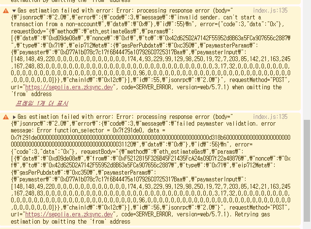

# 3. Approval Flow Paymaster

## Overview

In this tutorial, we will cover following topics:

- Understand the Approval Flow Paymaster and its limitations.
- Add dynamic fee calculation to the Approval Flow Paymaster.
- Integrate the Approval Flow Paymaster with the frontend.

This tutorial is for developers who:

- Interested in onboarding Web2 users to Web3 by providing a seamless social login experience.
- Want to learn how to create a approval flow paymaster with dynamic fee calculation.
- Build a project with zkSync network and get ready for the next hackathon.

## Series

- [1. Social Login with Privy and zkSync Network](https://github.com/piatoss3612/LibroLink/tree/01.social-login)
- [2. General Paymaster with custom features](https://github.com/piatoss3612/LibroLink/tree/02.general-paymaster)

## Table of Contents

- [Requirements](#requirements)
- [Approval Flow Paymaster](#approval-flow-paymaster)
- [Create stubs for the Approval Flow Paymaster](#3-create-stubs-for-the-approval-flow-paymaster)
- [Dynamic fee calculation](#dynamic-fee-calculation)
- [Price Converter Implementation](#price-converter-implementation)
- [Frontend Integration](#frontend-integration)
- [Demo](#demo)

## Requirements

- [Node.js](https://nodejs.org/en/download/)(v20.10.0 or later)
- [Yarn](https://classic.yarnpkg.com/en/docs/install)(v1.22.21 or later)
- [zksync-cli](https://docs.zksync.io/build/tooling/zksync-cli)(v1.8.2)

> This guide is following section of [2. General Paymaster with custom features](https://github.com/piatoss3612/LibroLink/tree/02.general-paymaster).

## Approval Flow Paymaster

### 0. What is Approval Flow Paymaster?

- The Approval Flow Paymaster is a contract that requires user approval such as token allowances to pay for transaction fees.
- It takes a specific ERC20 token as a fee from the user's account and pays the gas fees for accounts.

### 1. Approval Flow Paymaster Contract

- [ApprovalFlowPaymaster.sol](https://github.com/matter-labs/zksync-contract-templates/blob/main/templates/quickstart/hardhat/paymaster/contracts/ApprovalFlowPaymaster.sol) is a basic implementation of the Approval Flow Paymaster contract provided by zkSync.
- The contract pays the gas fees for accounts by taking some `allowedToken` as a fee from the user's account.

```solidity
// SPDX-License-Identifier: MIT
pragma solidity ^0.8.0;

import {
    IPaymaster,
    ExecutionResult,
    PAYMASTER_VALIDATION_SUCCESS_MAGIC
} from "@matterlabs/zksync-contracts/l2/system-contracts/interfaces/IPaymaster.sol";
import {IPaymasterFlow} from "@matterlabs/zksync-contracts/l2/system-contracts/interfaces/IPaymasterFlow.sol";
import {
    TransactionHelper,
    Transaction
} from "@matterlabs/zksync-contracts/l2/system-contracts/libraries/TransactionHelper.sol";

import "@matterlabs/zksync-contracts/l2/system-contracts/Constants.sol";

import "@openzeppelin/contracts/token/ERC20/IERC20.sol";
import "@openzeppelin/contracts/access/Ownable.sol";

/// @notice This smart contract pays the gas fees for accounts with balance of a specific ERC20 token. It makes use of the approval-based flow paymaster.
contract ApprovalFlowPaymaster is IPaymaster, Ownable {
    uint256 constant PRICE_FOR_PAYING_FEES = 1;

    address public allowedToken;

    modifier onlyBootloader() {
        require(msg.sender == BOOTLOADER_FORMAL_ADDRESS, "Only bootloader can call this method");
        _;
    }

    constructor() {
        allowedToken = 0x927488F48ffbc32112F1fF721759649A89721F8F;
    }

    function validateAndPayForPaymasterTransaction(bytes32, bytes32, Transaction calldata _transaction)
        external
        payable
        onlyBootloader
        returns (bytes4 magic, bytes memory context)
    {
        // Default to transaction acceptance
        magic = PAYMASTER_VALIDATION_SUCCESS_MAGIC;
        require(_transaction.paymasterInput.length >= 4, "The standard paymaster input must be at least 4 bytes long");

        bytes4 paymasterInputSelector = bytes4(_transaction.paymasterInput[0:4]);
        // Check if it's approval-based flow
        if (paymasterInputSelector == IPaymasterFlow.approvalBased.selector) {
            (address token, uint256 amount, bytes memory data) =
                abi.decode(_transaction.paymasterInput[4:], (address, uint256, bytes));

            // Ensure the token is the allowed one
            require(token == allowedToken, "Invalid token");

            // Check user's allowance
            address userAddress = address(uint160(_transaction.from));
            address thisAddress = address(this);
            uint256 providedAllowance = IERC20(token).allowance(userAddress, thisAddress);
            require(providedAllowance >= PRICE_FOR_PAYING_FEES, "Min allowance too low");

            uint256 requiredETH = _transaction.gasLimit * _transaction.maxFeePerGas;
            try IERC20(token).transferFrom(userAddress, thisAddress, amount) {}
            catch (bytes memory revertReason) {
                if (revertReason.length <= 4) {
                    revert("Failed to transferFrom from user's account");
                } else {
                    assembly {
                        revert(add(0x20, revertReason), mload(revertReason))
                    }
                }
            }

            (bool success,) = payable(BOOTLOADER_FORMAL_ADDRESS).call{value: requiredETH}("");
            require(success, "Failed to transfer tx fee to bootloader.");
        } else {
            revert("Unsupported paymaster flow");
        }
    }

    function postTransaction(
        bytes calldata _context,
        Transaction calldata _transaction,
        bytes32,
        bytes32,
        ExecutionResult _txResult,
        uint256 _maxRefundedGas
    ) external payable override onlyBootloader {}

    function withdraw(address _to) external onlyOwner {
        (bool success,) = payable(_to).call{value: address(this).balance}("");
        require(success, "Failed to withdraw funds from paymaster.");
    }

    receive() external payable {}
}
```

### 2. Considerations

- `ApprovalFlowPaymaster` contract only supports `requiredToken` as a fee. It is static and cannot be changed. We need to support multiple tokens for providing flexibility to users.
- Fee calculation is not dynamic and hardcoded in the contract as `PRICE_FOR_PAYING_FEES`. We need to calculate the fee dynamically based on the transaction details.

## 3. Create stubs for the Approval Flow Paymaster

- Create a new file `LibroERC20Paymaster.sol` in the `contracts/paymaster` directory.
- Copy the following code to the `LibroERC20Paymaster.sol` file.
- This contract is a stub for the Approval Flow Paymaster, which will be implemented in the next steps.
- The contract is inherited from the `IPaymaster` and `NftGated` contracts.
  - `IPaymaster` contract is an interface for the paymaster contract.
  - `NftGated` contract is a custom abstract contract for NFT gating.

```solidity
// SPDX-License-Identifier: MIT
pragma solidity ^0.8.24;

import {
    IPaymaster,
    ExecutionResult,
    PAYMASTER_VALIDATION_SUCCESS_MAGIC
} from "@matterlabs/zksync-contracts/l2/system-contracts/interfaces/IPaymaster.sol";
import {IPaymasterFlow} from "@matterlabs/zksync-contracts/l2/system-contracts/interfaces/IPaymasterFlow.sol";
import {
    TransactionHelper,
    Transaction
} from "@matterlabs/zksync-contracts/l2/system-contracts/libraries/TransactionHelper.sol";
import {BOOTLOADER_FORMAL_ADDRESS} from "@matterlabs/zksync-contracts/l2/system-contracts/Constants.sol";

import {NftGated, IERC721} from "./NftGated.sol";
import {IERC20} from "@openzeppelin/contracts/token/ERC20/IERC20.sol";

contract LibroERC20Paymaster is IPaymaster, NftGated {
    // ====== Custom Errors ======
    error LibroERC20Paymaster__ZeroAddress();
    error LibroERC20Paymaster__OnlyBootloaderCanCallThisMethod();
    error LibroERC20Paymaster__PaymasterInputShouldBeAtLeast4BytesLong();
    error LibroERC20Paymaster__MinimumAllowanceNotSatisfied(uint256 required, uint256 actual);
    error LibroERC20Paymaster__FailedToTransferTxFeeToBootloader();
    error LibroERC20Paymaster__UnsupportedPaymasterFlowInPaymasterParams();
    error LibroERC20Paymaster__FailedToWithdrawFundsFromPaymaster();

    event Refund(address indexed user, address indexed token, uint256 amount);

    // ====== Modifiers ======
    modifier onlyBootloader() {
        if (msg.sender != BOOTLOADER_FORMAL_ADDRESS) {
            revert LibroERC20Paymaster__OnlyBootloaderCanCallThisMethod();
        }
        // Continue execution if called from the bootloader.
        _;
    }

    // ====== Constructor ======
    constructor(address _nft) {
        nft = IERC721(_nft);
    }

    function validateAndPayForPaymasterTransaction(bytes32, bytes32, Transaction calldata _transaction)
        external
        payable
        onlyBootloader
        returns (bytes4 magic, bytes memory context)
    {
        // By default we consider the transaction as accepted.
        magic = PAYMASTER_VALIDATION_SUCCESS_MAGIC;
        if (_transaction.paymasterInput.length < 4) {
            revert LibroERC20Paymaster__PaymasterInputShouldBeAtLeast4BytesLong();
        }

        // Check if the user owns the NFT.
        address userAddress = address(uint160(_transaction.from));
        if (userAddress == address(0)) {
            revert LibroERC20Paymaster__ZeroAddress();
        }

        bytes4 paymasterInputSelector = bytes4(_transaction.paymasterInput[0:4]);

        // Check if the paymaster flow is approval based.
        if (paymasterInputSelector != IPaymasterFlow.approvalBased.selector) {
            revert LibroERC20Paymaster__UnsupportedPaymasterFlowInPaymasterParams();
        }

        // Decode the paymaster input.
        (address token, uint256 minAllowance,) = abi.decode(_transaction.paymasterInput[4:], (address, uint256, bytes));

        // Check if the user has enough allowance.
        uint256 actualAllowance = IERC20(token).allowance(userAddress, address(this));
        if (actualAllowance < minAllowance) {
            revert LibroERC20Paymaster__MinimumAllowanceNotSatisfied(minAllowance, actualAllowance);
        }

        // Note, that while the minimal amount of ETH needed is tx.gasPrice * tx.gasLimit,
        // neither paymaster nor account are allowed to access this context variable.
        uint256 requiredETH = _transaction.gasLimit * _transaction.maxFeePerGas;

        // TODO: Calculate the fee dynamically based on the requiredETH.

        // The bootloader never returns any data, so it can safely be ignored here.
        (bool success,) = payable(BOOTLOADER_FORMAL_ADDRESS).call{value: requiredETH}("");
        if (!success) {
            revert LibroERC20Paymaster__FailedToTransferTxFeeToBootloader();
        }
    }

    function postTransaction(
        bytes calldata _context,
        Transaction calldata _transaction,
        bytes32,
        bytes32,
        ExecutionResult _txResult,
        uint256 _maxRefundedGas
    ) external payable override onlyBootloader {
      // TODO: Implement the refund logic.
    }

    function withdraw(address payable _to) external {
        uint256 balance = address(this).balance;
        (bool success,) = _to.call{value: balance}("");
        if (!success) {
            revert LibroERC20Paymaster__FailedToWithdrawFundsFromPaymaster();
        }
    }

    receive() external payable {}
}
```

## Dynamic fee calculation

### 1. How to calculate the fee dynamically on-chain?

- The **oracle service** can be used to calculate the fee dynamically on-chain.
- Every token has a different price, directly using the price oracle is not feasible.
- Thus, we need to abstract the fee calculation logic as an interface and implement it for each token.

### 2. Create a Price Converter Interface

- `IPriceConverter` interface can be used to get the price of the token.
- Create a new file `IPriceConverter.sol` in the `contracts/token/interfaces` directory.

```solidity
// SPDX-License-Identifier: MIT
pragma solidity ^0.8.24;

interface IPriceConverter {
    function asset() external view returns (address, uint8);
    function priceFeed() external view returns (address);
    function latestAssetPrice() external view returns (uint256, uint8);
    function assetToEth(uint256 assetAmount) external view returns (uint256 ethAmount, uint8 decimals);
    function ethToAsset(uint256 ethAmount) external view returns (uint256 assetAmount, uint8 decimals);
}

```

- `asset` function returns the address of the token and its decimals.
- `priceFeed` function returns the address of the price feed(oracle).
- `latestAssetPrice` function returns the latest price of the token as `A/B` and price decimals.
- `assetToEth` function converts the token amount to ETH amount and returns the ETH amount and decimals.
- `ethToAsset` function converts the ETH amount to token amount and returns the token amount and decimals.

### 3. Support multiple tokens for fee

- We need to support multiple tokens for the fee to provide flexibility to users.
- This can be achieved by mapping the token address and its price converter in the contract.
- Create a new file `ERC20TokenPriceManager.sol` in the `contracts/token` directory.
- This contract manages the token price converters and provides the token price in ETH and ETH price in token.
- The contract is inherited from the `Ownable` contract.

```solidity
// SPDX-License-Identifier: MIT
pragma solidity ^0.8.24;

import {IPriceConverter} from "./interfaces/IPriceConverter.sol";
import {IERC20} from "@openzeppelin/contracts/token/ERC20/IERC20.sol";
import {Ownable} from "@openzeppelin/contracts/access/Ownable.sol";

abstract contract ERC20TokenPriceManager is Ownable {
    error ERC20TokenManager__InvalidToken();
    error ERC20TokenManager__InvalidPriceConverter();

    mapping(address => IPriceConverter) private _tokenPriceConverters;

    event TokenPriceConverterSet(address indexed token, IPriceConverter priceConverter);

    constructor() Ownable(msg.sender) {}

    function setTokenPriceConverter(address token, IPriceConverter priceConverter) external onlyOwner {
        if (token == address(0)) {
            revert ERC20TokenManager__InvalidToken();
        }

        if (address(priceConverter) == address(0)) {
            revert ERC20TokenManager__InvalidPriceConverter();
        }

        _tokenPriceConverters[token] = priceConverter;
        emit TokenPriceConverterSet(token, priceConverter);
    }

    function getTokenPriceConverter(address token) external view returns (IPriceConverter) {
        return _tokenPriceConverters[token];
    }

    function _requireTokenPriceConverter(address token) internal view returns (IPriceConverter converter) {
        converter = _tokenPriceConverters[token];
        if (address(converter) == address(0)) {
            revert ERC20TokenManager__InvalidToken();
        }
    }

    function getTokenPriceInEth(address token, uint256 amount) public view returns (uint256, uint8) {
        IPriceConverter converter = _requireTokenPriceConverter(token);
        return converter.assetToEth(amount);
    }

    function getEthPriceInToken(address token, uint256 ethAmount) public view returns (uint256, uint8) {
        IPriceConverter converter = _requireTokenPriceConverter(token);
        return converter.ethToAsset(ethAmount);
    }

    function withdraw(address token, address to, uint256 amount) external onlyOwner {
        IERC20(token).transferFrom(address(this), to, amount);
    }
}
```

- `setTokenPriceConverter` function sets the token price converter for the token.
- `getTokenPriceConverter` function returns the token price converter for the token.
- `_requireTokenPriceConverter` function checks if the token price converter is available for the token, otherwise reverts.
- `getTokenPriceInEth` function returns the token price in ETH.
- `getEthPriceInToken` function returns the ETH price in token.
- `withdraw` function withdraws the token from the contract.

### 4. Implement the Approval Flow Paymaster

- Now, we can implement the required logic in the `LibroERC20Paymaster` contract.

#### Add the required imports

- Add the following imports to the `LibroERC20Paymaster.sol` file to use the `ERC20TokenPriceManager` contract.

```solidity
import {ERC20TokenPriceManager} from "../token/ERC20TokenPriceManager.sol";
```

#### Inherit the `ERC20TokenPriceManager` contract

- Inherit the `ERC20TokenPriceManager` contract in the `LibroERC20Paymaster` contract.

```solidity
contract LibroERC20Paymaster is IPaymaster, NftGated, ERC20TokenPriceManager {
   ...
}
```

#### Add custom errors

- Add the custom errors for logic handling.

```solidity
error LibroERC20Paymaster__ExceededMinimumAllowance(uint256 required, uint256 allowed);
error LibroERC20Paymaster__FailedToTransferToken(address token);
```

#### Implement the dynamic fee calculation

- Implement the dynamic fee calculation in the `validateAndPayForPaymasterTransaction` function.

```solidity
function validateAndPayForPaymasterTransaction(bytes32, bytes32, Transaction calldata _transaction)
    external
    payable
    onlyBootloader
    returns (bytes4 magic, bytes memory context)
{
   ...

    // Note, that while the minimal amount of ETH needed is tx.gasPrice * tx.gasLimit,
    // neither paymaster nor account are allowed to access this context variable.
    uint256 requiredETH = _transaction.gasLimit * _transaction.maxFeePerGas;

    // Convert the required amount of ETH to tokens. If the token is not supported, the function will revert.
    (uint256 requiredToken,) = getEthPriceInToken(token, requiredETH);

    // Check if required token amount exceeds the minimal allowance.
    if (requiredToken > minAllowance) {
        revert LibroERC20Paymaster__ExceededMinimumAllowance(requiredToken, minAllowance);
    }

    // Check if the user owns the gated NFT.
    uint256 sponsoredAmount = 0;

    if (isNftOwner(userAddress)) {
        // Give 5% discount to the user.
        sponsoredAmount = (requiredToken * 5) / 100;
    }

    // Transfer the required amount of tokens to the paymaster.
    bool transferred = IERC20(token).transferFrom(userAddress, address(this), requiredToken - sponsoredAmount);
    if (!transferred) {
        revert LibroERC20Paymaster__FailedToTransferToken(token);
    }

    // Encode the token address, the required amount and the sponsored amount in the context.
    context = _encodeContext(token, requiredToken, sponsoredAmount);

    // The bootloader never returns any data, so it can safely be ignored here.
    (bool success,) = payable(BOOTLOADER_FORMAL_ADDRESS).call{value: requiredETH}("");
    if (!success) {
        revert LibroERC20Paymaster__FailedToTransferTxFeeToBootloader();
    }
}
```

1. The fee is calculated based on the `requiredETH` by converting it to the token amount using the `getEthPriceInToken` function.
2. `getEthPriceInToken` function returns the token amount and decimals based on the ETH amount. If the token is not supported, the function will revert.
3. Check if the required token amount exceeds the minimal allowance. If it exceeds, revert the transaction.
4. Check if the user owns the gated NFT. If the user owns the NFT, give a 5% discount to the user. (optional)
5. Transfer the required amount of tokens to the paymaster from the user's account.
6. Encode the token address, the required amount, and the sponsored amount in the context.
7. Transfer the required amount of ETH to the bootloader.

#### context encoding, decoding

- These functions are used to encode and decode the token address, the required amount, and the sponsored amount in the context.
- `context` created in the `validateAndPayForPaymasterTransaction` function is later used in the `postTransaction` function to refund excess tokens charged to the user.

```solidity
function _encodeContext(address _token, uint256 _requiredAmount, uint256 _sponsoredAmount)
    internal
    pure
    returns (bytes memory)
{
    return abi.encode(_token, _requiredAmount, _sponsoredAmount);
}

function _decodeContext(bytes memory _context)
    internal
    pure
    returns (address token, uint256 requiredAmount, uint256 sponsoredAmount)
{
    return abi.decode(_context, (address, uint256, uint256));
}
```

#### Implement the refund logic

- Implement the refund logic in the `postTransaction` function.
- The function refunds the excess tokens charged to the user at the `validateAndPayForPaymasterTransaction` function.

```solidity
function postTransaction(
    bytes calldata _context,
    Transaction calldata _transaction,
    bytes32,
    bytes32,
    ExecutionResult _txResult,
    uint256 _maxRefundedGas
) external payable override onlyBootloader {
    uint256 gasUsed = (_transaction.gasLimit - _maxRefundedGas) * _transaction.maxFeePerGas;

    (address token, uint256 requiredAmount,) = _decodeContext(_context);

    // Calculate the amount of tokens used.
    (uint256 usedToken,) = getEthPriceInToken(token, gasUsed);

    // Calculate the amount of tokens that should be refunded.
    uint256 refundAmount = requiredAmount - usedToken;

    // Take 2% fee from the used tokens for extra gas consumption.
    uint256 fee = (usedToken * 2) / 100;
    refundAmount -= fee;

    // Refund the unused tokens to the user.
    if (refundAmount > 0) {
        address userAddress = address(uint160(_transaction.from));
        bool transferred = IERC20(token).transfer(userAddress, refundAmount);
        if (!transferred) {
            revert LibroERC20Paymaster__FailedToTransferToken(token);
        }

        emit Refund(userAddress, token, refundAmount);
    }
}
```

1. Calculate the `gasUsed` by subtracting the `_maxRefundedGas` from the `_transaction.gasLimit` and multiplying it by the `_transaction.maxFeePerGas`.
2. Decode the context to get the token address, the required amount, and the sponsored amount. We only need the token address and the required amount.
3. Calculate the amount of tokens used by converting the `gasUsed` to the token amount.
4. Calculate the amount of tokens that should be refunded by subtracting the `usedToken` from the `requiredAmount`.
5. Take a 2% fee from the `usedToken` for extra gas consumption for the refund.
6. Refund the unused tokens to the user if the `refundAmount` is greater than 0.

#### Deploy the contract

- Before deploying the contract, compile the contracts using the following command.

```bash
$ yarn hardhat compile
```

- Write a deployment script for the `LibroERC20Paymaster` contract.
- Create a new file `deployLibroERC20Paymaster.ts` in the `scripts` directory.
- The script deploys the `LibroERC20Paymaster` contract and sends some ETH to the paymaster.

```typescript
import { ethers } from "ethers";
import { deployContract, getWallet } from "./utils";

export default async function () {
  // Deploy LibroERC20Paymaster
  const nftAddress = "0x2DcA9FdA301B22Bcc3ca7FA7B30b506CAF9205B5";

  const paymaster = await deployContract("LibroERC20Paymaster", [nftAddress]);

  // Send some ETH to the paymaster
  const wallet = getWallet();
  const paymasterAddress = await paymaster.getAddress();
  const value = ethers.parseEther("0.2");

  await (
    await wallet.sendTransaction({
      to: paymasterAddress,
      value,
    })
  ).wait();

  console.log("Sent 0.2 ETH to paymaster");
}
```

- Run the deployment script using the following command.

```bash
$ yarn hardhat deploy-zksync --script deployLibroERC20Paymaster.ts
yarn run v1.22.22

Starting deployment process of "LibroERC20Paymaster"...
Estimated deployment cost: 0.00190632135 ETH

"LibroERC20Paymaster" was successfully deployed:
 - Contract address: 0xE0d114C895933Ec646f851ce0C2faD1BB3726363
 - Contract source: contracts/paymaster/LibroERC20Paymaster.sol:LibroERC20Paymaster
 - Encoded constructor arguments: 0x0000000000000000000000002dca9fda301b22bcc3ca7fa7b30b506caf9205b5

Requesting contract verification...
Your verification ID is: 19840
Contract successfully verified on zkSync block explorer!
Sent 0.2 ETH to paymaster
Done in 19.14s.
```

- The `LibroERC20Paymaster` contract is successfully deployed and some ETH is sent to the paymaster.
- The contract address is `0xE0d114C895933Ec646f851ce0C2faD1BB3726363` and it is verified on the zkSync block explorer.

## Price Converter Implementation

### Choose a token to support

Even though we can support multiple tokens, we will choose a single token to support for simplicity in this tutorial.

- We will support the `USDC` token for the fee calculation.
- The `USDC` token is on zkSync Sepolia testnet, address: `0xAe045DE5638162fa134807Cb558E15A3F5A7F853`.
- However, when I tried to pay the fee with the `USDC` token, it failed with the following error, `Touched unallowed storage slots: address ae045de5638162fa134807cb558e15a3f5a7f853, key: 10d6a54a4754c8869d6886b5f5d7fbfa5b4522237ea5c60d11bc4e7a1ff9390b`.

```bash
An unknown RPC error occurred. Request Arguments: chain: zkSync Sepolia Testnet (id: 300) from: 0xF5212815F326B45F21435FcA24a09D7f22a48876 to: 0x42d625D2A7142F55952d8B63a5FCa907656c2887 data: 0xd09de08a Details: processing response error (body="{\"jsonrpc\":\"2.0\",\"error\":{\"code\":3,\"message\":\"failed to validate the transaction. reason: Violated validation rules: Touched unallowed storage slots: address ae045de5638162fa134807cb558e15a3f5a7f853, key: 10d6a54a4754c8869d6886b5f5d7fbfa5b4522237ea5c60d11bc4e7a1ff9390b\",\"data\":\"0x\"},\"id\":92}\n", error={"code":3,"data":"0x"}, requestBody="{\"method\":\"eth_sendRawTransaction\",\"params\":[\"0x71f9012710808401c9c3808310fdac9442d625d2a7142f55952d8b63a5fca907656c28878084d09de08a82012c808082012c94f5212815f326b45f21435fca24a09d7f22a4887682c350c0b841df4bbf4c287064b24af9146e65893044a672440c770a2b75c6878910baaadf6862230193cfa6d7ab3bb6dc2eb90df74219a95d31f6b82aa4255025af4dcb8c1c1cf89b94d77a1b078c7c17f6b44475a107926c0725317baab884949431dc000000000000000000000000ae045de5638162fa134807cb558e15a3f5a7f853000000000000000000000000000000000000000000000000000000000098968000000000000000000000000000000000000000000000000000000000000000600000000000000000000000000000000000000000000000000000000000000000\"],\"id\":92,\"jsonrpc\":\"2.0\"}", requestMethod="POST", url="https://sepolia.era.zksync.dev", code=SERVER_ERROR, version=web/5.7.1) Version: viem@2.13.1
```

- Found the discussion about the issue on [zkSync Community Forum](https://github.com/zkSync-Community-Hub/zksync-developers/discussions/236), but no obvious solution was found.
- It might be a bug with upgradeable proxy contracts, but I'm not sure about it.
- Thus, I will deploy `MockUSDC` using just a simple ERC20 token contract.

### Create MockUSDC

- Create a new file `MockUSDC.sol` in the `contracts/token` directory.
- The contract is a simple ERC20 token contract and has `faucet` function to mint tokens to the user.

```solidity
// SPDX-License-Identifier: MIT
pragma solidity ^0.8.24;

import {ERC20} from "@openzeppelin/contracts/token/ERC20/ERC20.sol";

contract MockUSDC is ERC20 {
    constructor() ERC20("MOCK USDC", "USDC") {
        _mint(msg.sender, 100000000000 * 10 ** decimals());
    }

    function faucet() external {
        _mint(msg.sender, 10000000 * 10 ** decimals());
    }

    function faucet(address to) external {
        _mint(to, 10000000 * 10 ** decimals());
    }

    function decimals() public view virtual override returns (uint8) {
        return 6;
    }
}
```

### Chainlink Price Feed

- We will use the Chainlink price feed as the price oracle for the `USDC` token.
- `USDC` is pegged to the USD, so we are using the `ETH/USD` price feed for the `USDC` token. Though it is not accurate, it is just for demonstration purposes.
- To use the Chainlink price feed, we need the contract address and `AggregatorV3Interface` interface.
- The price feed address is `0xfEefF7c3fB57d18C5C6Cdd71e45D2D0b4F9377bF`, and the interface is as follows.
- Create a new file `AggregatorV3Interface.sol` in the `contracts/token/interfaces` directory.

```solidity
// SPDX-License-Identifier: MIT
pragma solidity ^0.8.24;

interface AggregatorV3Interface {
    function decimals() external view returns (uint8);

    function description() external view returns (string memory);

    function version() external view returns (uint256);

    function getRoundData(uint80 _roundId)
        external
        view
        returns (uint80 roundId, int256 answer, uint256 startedAt, uint256 updatedAt, uint80 answeredInRound);

    function latestRoundData()
        external
        view
        returns (uint80 roundId, int256 answer, uint256 startedAt, uint256 updatedAt, uint80 answeredInRound);
}
```

- [Price Feed List on zkSync Sepolia](https://docs.chain.link/data-feeds/price-feeds/addresses?network=zksync&page=1#zksync-sepolia-testnet)

### Implement the Price Converter

- Create a new file `USDCPriceConverter.sol` in the `contracts/token` directory.
- The contract implements the `IPriceConverter` interface and provides the price of the `USDC` token.
- The contract uses the `MockUSDC` token and `ETH/USD` price feed to calculate the price.

```solidity
// SPDX-License-Identifier: MIT
pragma solidity ^0.8.24;

import {IPriceConverter} from "./interfaces/IPriceConverter.sol";
import {AggregatorV3Interface} from "./interfaces/AggregatorV3Interface.sol";
import {ERC20} from "@openzeppelin/contracts/token/ERC20/ERC20.sol";

contract USDCPriceConverter is IPriceConverter {
    error USDCPriceConverter__InvalidPrice();

    uint8 private constant ETH_DECIMALS = 18;

    ERC20 private _usdc;
    AggregatorV3Interface private _priceFeed; // ETH/USD price feed

    constructor(address usdc, address priceFeed_) {
        _usdc = ERC20(usdc);
        _priceFeed = AggregatorV3Interface(priceFeed_);
    }

    function asset() external view returns (address usdc, uint8 decimals) {
        return (address(_usdc), _usdc.decimals());
    }

    function priceFeed() external view returns (address) {
        return address(_priceFeed);
    }

    function latestAssetPrice() public view returns (uint256, uint8) {
        (, int256 price,,,) = _priceFeed.latestRoundData();
        if (price <= 0) {
            revert USDCPriceConverter__InvalidPrice();
        }

        return (uint256(price), _priceFeed.decimals());
    }

    function assetToEth(uint256 assetAmount) external view override returns (uint256 ethAmount, uint8 ethDecimals) {
        (uint256 price, uint8 priceDecimals) = latestAssetPrice(); // Get the latest price, and the decimals

        // Calculate the eth amount without decimals
        ethAmount = (assetAmount * (10 ** priceDecimals)) / price;

        // Adjust decimals to match ETH's 18 decimals
        ethAmount = (ethAmount * (10 ** (ETH_DECIMALS - _usdc.decimals())));
        ethDecimals = ETH_DECIMALS;
    }

    function ethToAsset(uint256 ethAmount) external view override returns (uint256 assetAmount, uint8 assetDecimals) {
        (uint256 price, uint8 priceDecimals) = latestAssetPrice(); // Get the latest price, and the decimals

        // Calculate the asset amount without decimals
        assetAmount = (ethAmount * price) / (10 ** priceDecimals);

        // Adjust decimals to match the asset's decimals
        assetAmount = (assetAmount * (10 ** _usdc.decimals())) / (10 ** ETH_DECIMALS);
        assetDecimals = _usdc.decimals();
    }
}
```

### Deploy the contracts

- Deploy the `MockUSDC` and `USDCPriceConverter` contracts using the deployment script.

```typescript
import { Contract } from "ethers";
import { deployContract, getWallet } from "./utils";
import { HardhatRuntimeEnvironment } from "hardhat/types";

export default async function (hre: HardhatRuntimeEnvironment) {
  // Deploy USDCPriceConverter
  const mockUSDC = await deployContract("MockUSDC", []);
  const mockUSDCAddress = await mockUSDC.getAddress();

  const priceFeed = "0xfEefF7c3fB57d18C5C6Cdd71e45D2D0b4F9377bF"; // ETH/USD

  const priceConverter = await deployContract("USDCPriceConverter", [
    mockUSDCAddress,
    priceFeed,
  ]);

  const wallet = getWallet();
  const erc20PaymasterAddress = "0xE0d114C895933Ec646f851ce0C2faD1BB3726363";
  const erc20PaymasterArtifact = await hre.artifacts.readArtifact(
    "LibroERC20Paymaster"
  );

  const erc20Paymaster = new Contract(
    erc20PaymasterAddress,
    erc20PaymasterArtifact.abi,
    wallet
  );

  // Set USDCPriceConverter in LibroERC20Paymaster
  const priceConverterAddress = await priceConverter.getAddress();

  const tx = await erc20Paymaster.setTokenPriceConverter(
    mockUSDCAddress,
    priceConverterAddress
  );

  await tx.wait();

  console.log("Successfully set USDCPriceConverter in LibroERC20Paymaster");
}
```

- Run the deployment script using the following command.

```bash
$ yarn hardhat deploy-zksync --script deployUSDCPriceConverter.ts
yarn run v1.22.22

Starting deployment process of "MockUSDC"...
Estimated deployment cost: 0.0009902508 ETH

"MockUSDC" was successfully deployed:
 - Contract address: 0xF2551686FC417A5Ba80330e48023D12D8F82c61a
 - Contract source: contracts/token/MockUSDC.sol:MockUSDC
 - Encoded constructor arguments: 0x

Requesting contract verification...
Your verification ID is: 19841
Contract successfully verified on zkSync block explorer!

Starting deployment process of "USDCPriceConverter"...
Estimated deployment cost: 0.00003843915 ETH

"USDCPriceConverter" was successfully deployed:
 - Contract address: 0x1C1b70e2580CF3eCd6FbCB211308400938BaC31a
 - Contract source: contracts/token/USDCPriceConverter.sol:USDCPriceConverter
 - Encoded constructor arguments: 0x000000000000000000000000f2551686fc417a5ba80330e48023d12d8f82c61a000000000000000000000000feeff7c3fb57d18c5c6cdd71e45d2d0b4f9377bf

Requesting contract verification...
Your verification ID is: 19842
Contract successfully verified on zkSync block explorer!
Successfully set USDCPriceConverter in LibroERC20Paymaster
Done in 24.59s.
```

- The `MockUSDC` and `USDCPriceConverter` contracts are successfully deployed and verified on the zkSync block explorer.
- The `USDCPriceConverter` contract is set in the `LibroERC20Paymaster` contract.

## Frontend Integration

> **Note**: Since the last sections of the tutorial, we have been refactoring the frontend, so a lot of changes have been made. Thus, I will provide only the code related to this section. You can check the full code in the [GitHub repository](https://github.com/piatoss3612/LibroLink/tree/03.approval-based-paymaster)

### 1. Add Address and ABI of the new contracts

- Add the address and ABI of the `MockUSDC` and `USDCPriceConverter` contracts in the `frontend/libs` directory.

#### MockUSDC

- Create a new file `ERC20.ts` in the `frontend/libs` directory.

```typescript
const ERC20_ABI = [
   ...
] as const;

export default ERC20_ABI;
```

#### LibroERC20Paymaster

- Add the address and ABI of the `LibroERC20Paymaster` contract in the `frontend/libs/LibroPaymaster.ts` file.

```typescript
const LIBRO_ERC20_PAYMASTER_ADDRESS =
  "0xE0d114C895933Ec646f851ce0C2faD1BB3726363" as `0x${string}`;

const LIBRO_ERC20_PAYMASTER_ABI = [
   ...
] as const;

export {
  LIBRO_PAYMASTER_ADDRESS,
  LIBRO_PAYMASTER_ABI,
  LIBRO_ERC20_PAYMASTER_ADDRESS,
  LIBRO_ERC20_PAYMASTER_ABI,
};
```

### 2. Define types for the new contracts

- Define the types for the paymaster and supported tokens in the `frontend/types/index.d.ts` file.

```typescript
type PaymasterType = "general" | "approval";

type ERC20TokenMetadata = {
  address: `0x${string}`;
  decimals: number;
  symbol: string;
  name: string;
};

...

export { PaymasterType, PaymasterRequest, ERC20TokenMetadata };
```

### 3. Update the Paymaster context

- Update the `PaymasterContext` in the `frontend/context/Paymaster.tsx` file.

#### State and Variables

- Add the state and variables for the paymaster type and the selected token for user approval.

```typescript
// State for the paymaster (general, approval)
const [paymasterType, setPaymasterType] = useState<PaymasterType>("general");
const [selectedToken, setSelectedToken] = useState<ERC20TokenMetadata | null>(
  null
);
const supportedTokensList: ERC20TokenMetadata[] = [
  {
    address: USDC_ADDRESS,
    decimals: 6,
    symbol: "USDC",
    name: "USDC",
  },
];
const isGeneralPaymaster = paymasterType === "general";
```

#### Price Conversion Function

- Add the `getEthPriceInToken` function to get the gas fee in the selected token.

```typescript
const getEthPriceInToken = async (
  tokenAddress: `0x${string}`,
  ethAmount: bigint
): Promise<readonly [bigint, number]> => {
  if (!publicClient) {
    throw new Error("Public client not found");
  }

  return await publicClient.readContract({
    address: LIBRO_ERC20_PAYMASTER_ADDRESS,
    abi: LIBRO_ERC20_PAYMASTER_ABI,
    functionName: "getEthPriceInToken",
    args: [tokenAddress, ethAmount],
  });
};
```

#### Token Info Function

- Add the `getTokenBalance` and `getTokenDecimals` functions to get the token balance of the user and the token decimals.
- These functions are used to display the token balance in the UI.

```typescript
const getTokenBalance = async (
  tokenAddress: `0x${string}`,
  account: `0x${string}`
): Promise<bigint> => {
  if (!publicClient) {
    throw new Error("Public client not found");
  }

  return await publicClient.readContract({
    address: tokenAddress,
    abi: ERC20_ABI,
    functionName: "balanceOf",
    args: [account],
  });
};

const getTokenDecimals = async (
  tokenAddress: `0x${string}`
): Promise<number> => {
  if (!publicClient) {
    throw new Error("Public client not found");
  }

  return await publicClient.readContract({
    address: tokenAddress,
    abi: ERC20_ABI,
    functionName: "decimals",
  });
};
```

#### Execute Queries

- Execute the queries for the token balance, token decimals, and ETH price in the token when the paymaster type is changed or the selected token is changed.

```typescript
const [tokenBalanceQuery, tokenDecimalsQuery, ethPriceInTokenQuery] =
  useQueries({
    queries: [
      {
        queryKey: ["tokenBalance", selectedToken?.address, wallet?.address],
        queryFn: async () => {
          return await getTokenBalance(
            selectedToken!.address,
            wallet!.address as `0x${string}`
          );
        },
        enabled: !!publicClient && !!selectedToken && !isGeneralPaymaster,
        refetchInterval: 3000,
      },
      {
        queryKey: ["tokenDecimals", selectedToken?.address],
        queryFn: async () => {
          return await getTokenDecimals(selectedToken!.address);
        },
        enabled: !!publicClient && !!selectedToken && !isGeneralPaymaster,
        refetchInterval: 3000,
      },
      {
        queryKey: ["ethPriceInToken", selectedToken?.address],
        queryFn: async () => {
          const estimateFee = await getEstimateFee();
          const fee = estimateFee.gasLimit * estimateFee.maxFeePerGas;

          return await getEthPriceInToken(selectedToken!.address, fee);
        },
        enabled: !!publicClient && !!selectedToken && !isGeneralPaymaster,
        refetchInterval: 3000,
      },
    ],
  });
```

- Use the `tokenBalanceQuery`, `tokenDecimalsQuery`, and `ethPriceInTokenQuery` in the UI to display the token balance, token decimals, and the gas fee in the selected token.

```typescript
const ethPriceInToken = formatUnitsToFixed(
  ethPriceInTokenData[0],
  ethPriceInTokenData[1]
);
const tokenBalance = formatUnitsToFixed(
  tokenBalanceQuery.data || BigInt(0),
  tokenDecimalsQuery.data || 0
);
```

#### Modify getEstimateFee function

- Modify the `getEstimateFee` function to get the paymaster input based on the paymaster type.
- In case of the approval flow paymaster, it doesn't know the required token amount, so it uses the token balance of the user as the minimum allowance.

```typescript
const getEstimateFee = async (): Promise<EstimateFeeReturnType> => {
  if (!publicClient || !wallet) {
    throw new Error("Required client or wallet not found");
  }

  if (!request) {
    throw new Error("Request not found");
  }

  let paymaster = LIBRO_PAYMASTER_ADDRESS;
  let paymasterInput = getGeneralPaymasterInput({
    innerInput: "0x",
  });

  // Get the paymaster input based on the paymaster type
  if (!isGeneralPaymaster) {
    if (!selectedToken) {
      throw new Error("Token not found");
    }

    const tokenBalance = await getTokenBalance(
      selectedToken.address,
      wallet.address as `0x${string}`
    );

    paymaster = LIBRO_ERC20_PAYMASTER_ADDRESS;
    paymasterInput = getApprovalBasedPaymasterInput({
      innerInput: "0x",
      minAllowance: tokenBalance,
      token: selectedToken.address,
    });
  }

  return await publicClient.estimateFee({
    account: request.from || (wallet.address as `0x${string}`),
    to: request.to,
    data: request.data,
    value: request.value,
    paymaster,
    paymasterInput,
  });
};
```

#### Modify the confirmPayment function

- As similar to the `getEstimateFee` function, modify the `confirmPayment` function to get the paymaster input based on the paymaster type.

```typescript
const confirmPayment = async () => {
  try {
    if (!wallet || !zkSyncClient) {
      throw new Error("Wallet or zkSync client not found");
    }

    if (!request) {
      throw new Error("Request not found");
    }

    setIsLoading(true);

    // Get the paymaster input
    let paymaster = LIBRO_PAYMASTER_ADDRESS;
    let paymasterInput = getGeneralPaymasterInput({
      innerInput: "0x",
    });

    // Get the paymaster input based on the paymaster type
    if (!isGeneralPaymaster) {
      if (!selectedToken) {
        throw new Error("Token not found");
      }

      const estimateFee = await getEstimateFee();
      const cost = estimateFee.gasLimit * estimateFee.maxFeePerGas;
      const tokenAmount = await getEthPriceInToken(selectedToken.address, cost);

      const tokenBalance = await getTokenBalance(
        selectedToken.address,
        wallet.address as `0x${string}`
      );

      // Just in case the token amount is less than the fee, add some extra 20% token
      paymaster = LIBRO_ERC20_PAYMASTER_ADDRESS;
      paymasterInput = getApprovalBasedPaymasterInput({
        innerInput: "0x",
        // minAllowance: tokenAmount[0] * BigInt(1000),
        minAllowance: tokenBalance,
        token: selectedToken.address,
      });
    }

    // Send the transaction
    const hash = await zkSyncClient.sendTransaction({
      account: request.from || (wallet.address as `0x${string}`),
      to: request.to,
      data: request.data,
      value: request.value,
      chain: zkSyncSepoliaTestnet,
      paymaster,
      paymasterInput,
    });

    // Wait for the transaction receipt
    const receipt = await publicClient.waitForTransactionReceipt({ hash });

    // Update the result
    setTxHash(hash);
    setTxStatus(receipt.status);
  } catch (error) {
    const errorMessage =
      error instanceof Error ? error.message : "Unknown error";
    toast({
      title: "Error",
      description: errorMessage,
      status: "error",
      duration: 5000,
      isClosable: true,
    });
  } finally {
    setIsLoading(false);
  }
};
```

- In case of the approval flow paymaster, for accurate fee calculation, the gas estimation is done then the fee is converted to the token amount using the `getEthPriceInToken` function.
- However, the token balance of the user is used as the minimum allowance for the approval flow paymaster.
- Because `sendTransaction` function is not behaving as expected, it estimates more gas than calculated at the paymaster input ready time. So, on-chain verification fails due to the insufficient token balance.
- Related to this issue, I have received two error in turn while `sendTransaction` function is called:

  1.  `"invalid sender. can't start a transaction from a non-account"`.
  2.  `"failed paymaster validation. error message: Error function_selector = 0x7f291de0, data = 0x7f291de00000000000000000000000000000000000000000000000000000000000d1ffc500000000000000000000000000000000000000000000000000000000000185df"`

#### Error Analysis

1. The first error, `"failed paymaster validation."`

   - When the `sendTransaction` function runs gas estimation, it seems to specify more gas than the actual gas required.
   - Thus, the token allowance is not enough for the paymaster to proceed with the transaction.
   - By decoding the error message, the error is `LibroERC20Paymaster__ExceededMinimumAllowance(uint256 required, uint256 allowed)` - The `required` amount is `13762501` and the `allowed` amount is `99807`. It's more than 100 times different.

2. The second error, `"invalid sender. can't start a transaction from a non-account"`

   - This error occurs just after the first error, the `sendTransaction` function omits the `from` field in the transaction object and re-estimate the gas.
   - [Related Discussion](https://github.com/zkSync-Community-Hub/zksync-developers/discussions/144)



#### Temporary Error Handling

- To handle the error, I will set the minimum allowance as the token balance of the user for the approval flow paymaster.
- It is not the best solution and not recommended, but it is a temporary solution to proceed with the tutorial.
- I will find a better solution and update the tutorial later. Maybe, skipping the gas estimation and directly sending the transaction with the calculated fee will work.

```typescript
paymaster = LIBRO_ERC20_PAYMASTER_ADDRESS;
paymasterInput = getApprovalBasedPaymasterInput({
  innerInput: "0x",
  minAllowance: tokenBalance,
  token: selectedToken.address,
});
```

### 4. Update the UI

- Update and add the UI components in the `frontend/components/paymaster` directory.

#### PaymentModalBody

- Update the `PaymentModalBody` component in the `frontend/components/paymaster/payment/PaymentModalBody.tsx` file.
- It displays the tabs for the general and approval flow paymasters, and the user can switch between them.

```tsx
import {
  ModalBody,
  Tab,
  TabList,
  TabPanel,
  TabPanels,
  Tabs,
} from "@chakra-ui/react";
import usePaymaster from "@/hooks/usePaymaster";
import GeneralPaymasterTab from "./GeneralPaymasterTab";
import ApprovalBasedPaymasterTab from "./ApprovalBasedPaymasterTab";
import { PaymasterType } from "@/types";

const PaymentModalBody = () => {
  const { paymasterType, setPaymasterType } = usePaymaster();
  const tabs = [
    {
      name: "General",
      paymasterType: "general" as PaymasterType,
      component: <GeneralPaymasterTab />,
    },
    {
      name: "Approval",
      paymasterType: "approval" as PaymasterType,
      component: <ApprovalBasedPaymasterTab />,
    },
  ];

  const handleTabChange = (index: number) => {
    setPaymasterType(tabs[index].paymasterType);
  };

  return (
    <ModalBody bg={"gray.100"} mx={6} rounded={"md"}>
      <Tabs isFitted onChange={handleTabChange} variant="soft-rounded">
        <TabList>
          {tabs.map((tab, index) => (
            <Tab key={index}>{tab.name}</Tab>
          ))}
        </TabList>
        <TabPanels>
          {tabs.map((tab, index) => (
            <TabPanel key={index}>{tab.component}</TabPanel>
          ))}
        </TabPanels>
      </Tabs>
    </ModalBody>
  );
};

export default PaymentModalBody;
```

#### ApprovalBasedPaymasterTab

- Create a new file `ApprovalBasedPaymasterTab.tsx` in the `frontend/components/paymaster/payment` directory.

```tsx
import React from "react";
import { Divider, Highlight, TabPanel, Stack, Select } from "@chakra-ui/react";
import { Line } from "../common";
import usePaymaster from "@/hooks/usePaymaster";

const ApprovalBasedPaymasterTab = () => {
  const {
    requestName,
    fee,
    gasPrice,
    cost,
    errorMessage,
    selectedToken,
    setSelectedToken,
    supportedTokensList,
    tokenBalance,
    ethPriceInToken,
  } = usePaymaster();

  const tokenSymbol = selectedToken ? selectedToken.symbol : "";

  const handleTokenChange = (e: React.ChangeEvent<HTMLSelectElement>) => {
    setSelectedToken(supportedTokensList[Number(e.target.value)]);
  };

  return (
    <TabPanel>
      <Stack spacing={4} justify="center" align="center">
        {errorMessage && (
          <Highlight
            query={errorMessage}
            styles={{
              px: "2",
              py: "1",
              rounded: "full",
              bg: "red.500",
              fontWeight: "bold",
              fontSize: "lg",
              color: "white",
            }}
          >
            {errorMessage}
          </Highlight>
        )}
        <Line left="Transaction:" right={requestName} />
        <Line left="Transaction Fee:" right={`${fee} ETH`} />
        <Line left="Gas Price:" right={`${gasPrice} ETH`} />
        <Divider />
        <Select
          variant="flushed"
          placeholder="Select Supported Token"
          onChange={handleTokenChange}
        >
          {supportedTokensList.map((token, idx) => (
            <option key={idx} value={idx}>
              {token.name}
            </option>
          ))}
        </Select>
        <Line left="Token Balance:" right={`${tokenBalance} ${tokenSymbol}`} />
        <Divider />
        <Line left="Estimated Cost:" right={`${cost} ETH`} />
        <Divider />
        <Line left="Total Cost:" right={`${ethPriceInToken} ${tokenSymbol}`} />
      </Stack>
    </TabPanel>
  );
};

export default ApprovalBasedPaymasterTab;
```

- The `ApprovalBasedPaymasterTab` component displays the token balance of the user, the supported tokens list, and the estimated cost in the selected token.
- The user can select the token from the supported tokens list and see the estimated cost in the selected token.

### 5. Add Faucet Claim Button

- Add a faucet claim button to the `Dashboard` component in the `frontend/components/home/Dashboard.tsx` file.
- The user can claim the `MockUSDC` token from the faucet and use it for the approval flow paymaster.

```tsx
const Dashboard = () => {
  const getFaucet = async () => {
    if (!wallet) {
      return;
    }

    const data = encodeFunctionData({
      abi: [
        {
          inputs: [],
          name: "faucet",
          outputs: [],
          stateMutability: "nonpayable",
          type: "function",
        },
      ],
      functionName: "faucet",
    });

    openPaymasterModal({
      name: "MockUSDC Faucet",
      from: wallet.address as `0x${string}`,
      to: USDC_ADDRESS,
      data,
    });
  };

  return (
    <Box display="flex" flexDirection="column">
      <Center my="auto">
        {wallet && (
          <VStack spacing={4}>
            ...
            <VStack spacing={4} border="1px" borderRadius={"md"} p={8} m={4}>
              <Heading>Faucet</Heading>
              <Button
                onClick={getFaucet}
                bg="brand.rustyBrown"
                color="white"
                _hover={{ bg: "brand.darkChocolate" }}
              >
                Claim MockUSDC
              </Button>
            </VStack>
          </VStack>
        )}
      </Center>
    </Box>
  );
};

export default Dashboard;
```

## Demo

(WIP)
